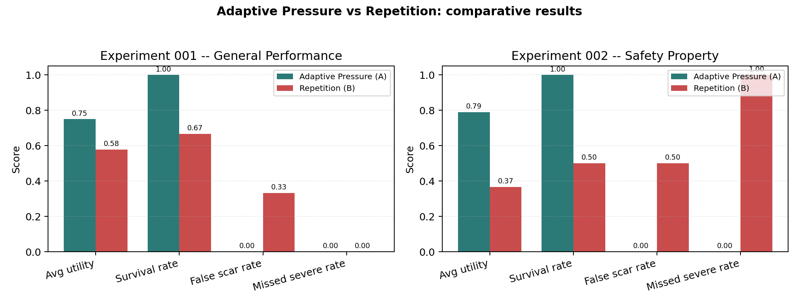

# Scar Memory Agent — Adaptive-Pressure Scar Formation for Emergent Capabilities

**Draft v0.9 — Rebuild**

---

## Table of Contents / Indice

**English**

- [Abstract](#abstract)
- [1. Introduction](#1-introduction)
- [2. Related Work](#2-related-work)
- [3. Methodology](#3-methodology)
- [4. Experimental Setup](#4-experimental-setup)
- [5. Results](#5-results)
- [6. Discussion](#6-discussion)
- [7. Limitations](#7-limitations)
- [8. Conclusion](#8-conclusion)
- [Reproducibility Statement](#reproducibility-statement)

**Espanol**

- [Resumen](#resumen)
- [1. Introduccion](#1-introduccion)
- [2. Trabajo Relacionado](#2-trabajo-relacionado)
- [3. Metodologia](#3-metodologia)
- [4. Configuracion Experimental](#4-configuracion-experimental)
- [5. Resultados](#5-resultados)
- [6. Discusion](#6-discusion)
- [7. Limitaciones](#7-limitaciones)
- [8. Conclusion](#8-conclusion-1)
- [Declaracion de Reproducibilidad](#declaracion-de-reproducibilidad)

---

## Abstract

We present a mechanism by which an autonomous agent transforms recurring
failures into persistent capabilities through the formation of "scars".
Unlike repetition-based approaches that count identical errors, our
mechanism models scar formation as a function of cumulative adaptive
pressure, combining failure frequency, severity, and impact. We evaluate
the mechanism against a repetition-based baseline across two complementary
experiments. The adaptive-pressure agent achieved 29.8% higher average
capability utility and 50.0% higher survival rate in a probabilistic
stream of 500 events, and detected 100% of rare severe failures that the
baseline missed entirely. All results are reproducible from a fixed seed
and a shared error stream.

---

## 1. Introduction

Autonomous agents that operate over long horizons accumulate failures.
Most systems treat these failures as transient events: they log them,
retry, and move on. The failure leaves no persistent trace, and the agent
is free to repeat the same mistake indefinitely. This is not a memory
problem in the conventional sense; it is a *learning* problem. A system
that cannot convert experience into structure will keep paying the same
cost forever.

We propose a mechanism by which an agent transforms recurring failures
into persistent *scars*, and scars into *capabilities*. A scar is not a
log entry: it is a structural modification of the agent's behavior,
formed only when the cumulative *adaptive pressure* of a class of
failures exceeds a threshold. Adaptive pressure combines three
dimensions of failure:

- **Frequency:** how often the failure occurs.
- **Severity:** how damaging a single occurrence is.
- **Impact:** how far the consequences propagate.

This is a deliberate departure from repetition-based approaches, which
trigger on raw counts alone. Repetition is a poor proxy for relevance.
A thousand trivial warnings are not equivalent to a single data
corruption event, yet a frequency-based trigger cannot distinguish
between the two. Our core claim is that *adaptive pressure*, not
frequency, is the correct signal for structural adaptation.

### Contributions

This paper makes three contributions.

1. **A mechanism.** We define a scar formation algorithm based on
   cumulative adaptive pressure, formalizing the intuition that
   failures carry different evolutionary weight depending on their
   severity and impact, not only their frequency.

2. **A lifecycle.** We introduce an evolutionary lifecycle for the
   capabilities that emerge from scars (NACIENTE, ACTIVA,
   CONSOLIDADA), in which every capability must justify its continued
   existence through measurable utility or risk obsolescence.

3. **An empirical evaluation.** We compare adaptive-pressure formation
   against a repetition-based baseline across two complementary
   experiments. The adaptive-pressure agent produced capabilities with
   29.8% higher average utility and 50.0% higher survival rate in a
   probabilistic stream of 500 events, and detected 100% of rare
   severe failures that the repetition baseline missed entirely. All
   results are reproducible from a fixed seed and a shared error stream.

### Structure of the paper

Section 2 reviews related work on failure memory, evolutionary agents,
and adaptive systems. Section 3 describes the mechanism in detail.
Section 4 defines the experimental setup. Section 5 reports results.
Section 6 discusses implications. Section 7 states limitations
explicitly. Section 8 concludes.

---

## 2. Related Work

Our work sits at the intersection of four lines of research. We
describe each, then state the gap that none of them fills.

### 2.1 Memory in Cognitive Architectures

Cognitive architectures such as Soar and ACT-R have long modeled
memory as a structured component of agent behavior, distinguishing
declarative, procedural, and episodic memory. In these systems,
experience modifies future behavior through rule learning and
chunking. Our mechanism shares the goal of structural adaptation
through experience, but differs in two respects: we do not assume
a symbolic rule base, and our trigger for adaptation is not the
frequency of a pattern but its *adaptive pressure*, a weighted
combination of frequency, severity, and impact.

### 2.2 Evolutionary and Adaptive Agents

Evolutionary computation and neuroevolution (e.g., NEAT, POET)
produce adaptive behavior through selection over generations of
candidate solutions. Adaptation is population-level and driven by
an external fitness function. Our mechanism operates within a
single agent, over a single lifetime, and the "fitness" of a
capability is not assigned externally; it emerges from measured
utility during use. This makes the mechanism closer to lifelong
learning than to population-based evolution, while retaining the
selectionist intuition that not all capabilities should survive.

### 2.3 Failure-Tolerant Systems

Engineering practice has produced a mature set of techniques for
handling failure: retry policies, circuit breakers, bulkheads,
and chaos engineering. These approaches typically treat failures
as operational events to be contained, not as signals for
structural adaptation. A circuit breaker opens and closes based
on error rates; it does not create a persistent capability. Our
work shares the intuition that failures should modify system
behavior, but pushes the modification one level deeper: the
system does not just react, it *learns a new structural response*
that persists across sessions.

### 2.4 Biological Scarring as Metaphor

The term "scar" is borrowed from biology, where it denotes
persistent tissue modification following injury. We use the term
deliberately: scars are not errors (transient), not logs
(informational), and not rules (predefined). They are *structural
modifications produced by the history of the system itself*.
We do not claim a literal biological analogy; only that the
conceptual vocabulary is more faithful to what the mechanism
does than the vocabulary of "memory" or "cache".

### 2.5 The Gap

None of the above lines combines the following three properties:

- **(P1)** Adaptation is triggered by a multi-dimensional pressure
  signal (frequency, severity, impact), not by raw repetition.
- **(P2)** Capabilities that emerge from adaptation are subject to
  an explicit evolutionary lifecycle with measurable survival criteria.
- **(P3)** Every step of the process is persisted in a form that
  allows full reproducible reconstruction from raw events.

The mechanism presented in this paper satisfies all three. This is
the gap we address.

---

## 3. Methodology

### 3.1 Wound Model

A *wound* is the atomic record of a failure event. Every wound carries
four fields:

| Field       | Type    | Range     | Meaning                                |
|-------------|---------|-----------|----------------------------------------|
| error_type  | string  | -         | semantic class of the failure          |
| severity    | float   | [0, 1]    | intrinsic damage of a single occurrence|
| impact      | float   | [0, 1]    | propagation reach of the consequences  |
| created_at  | ISO-8601| -         | timestamp of the event                 |

Wounds are never deleted. They form the immutable evidence base from
which all higher structures (scars, capabilities) are derived. A wound
does not, by itself, modify agent behavior. It is an *observation*, not
an *action*.

The distinction is deliberate: we separate *what happened* from *what
the system decides to do about it*. This separation is what allows the
same wound history to be interpreted by different agents (Section 4)
without any modification to the underlying data.

### 3.2 Adaptive Pressure

*Adaptive pressure* is the signal that determines whether a class of
failures is significant enough to trigger structural change. For a
given error type e observed n times in an experiment, we define:

~~~
freq_norm(e) = min(n / 10, 1)  (1)

sev_avg(e) = mean(severity of all wounds of type e)  (2)

imp_avg(e) = mean(impact of all wounds of type e)  (3)

pressure(e) = freq_norm(e) x 0.4 + sev_avg(e) x 0.3 + imp_avg(e) x 0.3  (4)
~~~

**Design justification.**

- The normalization constant 10 in (1) is chosen so that ten
  occurrences of any error saturate the frequency component. This
  reflects the intuition that, beyond a certain repetition count,
  additional occurrences add little information.
- The weights 0.4 / 0.3 / 0.3 are a priori values, fixed for the
  experiments reported here. They are not tuned to any specific
  result. Sensitivity analysis under different weights is left to
  future work.
- All components lie in [0, 1], so pressure(e) is in [0, 1]. This
  makes the threshold in Section 3.3 interpretable as a probability-
  like quantity, though it is not one.

**What the formula encodes.** Pressure is not frequency. A single
event with severity 0.95 and impact 0.99 produces:

~~~
freq_norm = 0.1
pressure  = 0.1 x 0.4 + 0.95 x 0.3 + 0.99 x 0.3
          = 0.04 + 0.285 + 0.297
          = 0.622
~~~

which exceeds the threshold defined below. Conversely, ten trivial
events (severity 0.1, impact 0.1) produce:

~~~
freq_norm = 1.0
pressure  = 1.0 x 0.4 + 0.1 x 0.3 + 0.1 x 0.3
          = 0.40 + 0.03 + 0.03
          = 0.46
~~~

which does *not* exceed the threshold. This asymmetry is the core
of the mechanism: pressure rewards *severity-weighted* failure
histories, not merely frequent ones.

### 3.3 Scar Formation

A *scar* is created for an error type e when:

~~~
pressure(e) >= tau  (5)
~~~

where tau = 0.55 is the formation threshold. The value tau = 0.55
was fixed a priori and is used in all experiments reported in this
paper.

When a scar is formed, the system:

1. Creates a persistent record with a unique identifier, the
   computed pressure, the threshold used, and a formula version tag.
2. Links every wound that contributed to the pressure calculation,
   storing the fractional contribution of each wound.
3. Sets the scar status to ACTIVE.

**Formula versioning.** The scar record stores the formula version
string alongside the computed pressure. This allows future revisions
of the pressure formula to be applied without invalidating historical
records.

**Why pressure, not repetition.** A repetition rule would form a scar
whenever n >= k for some fixed k. Setting k = 3 would:

- Form a scar for 3 trivial events, which contributes to the false-
  positive rate observed in the baseline (Section 5).
- Fail to form a scar for 1 severe event, which contributes to the
  missed-severe rate observed in the baseline (Section 5).

Neither failure mode is possible under the pressure formulation,
provided the severe event carries sufficient severity and impact.
This is not a tuning advantage; it is a structural property of the
mechanism.

---

### 3.4 Capability Registry and Lifecycle

Every scar may give rise to a *capability*: a structural adaptation
that can be invoked in future situations. Capabilities are tracked
in a registry, and each capability carries its own state and usage
history.

**Attributes.**

| Attribute         | Meaning                                       |
|-------------------|-----------------------------------------------|
| id                | unique identifier                             |
| name              | human-readable name                           |
| origin_scar_id    | scar from which the capability emerged        |
| created_at        | timestamp                                     |
| state             | current lifecycle state                       |
| utility_score     | success_count / usage_count                   |
| usage_count       | total invocations                             |
| success_count     | invocations that avoided the original error   |
| failure_count     | invocations that did not                      |
| description       | free-text note                                |

**Lifecycle states.** A capability transitions through the
following states:

~~~
NACIENTE  ->  ACTIVA  ->  CONSOLIDADA  ->  OBSOLETA  ->  RETIRADA
~~~

Transitions are evaluated after every recorded usage:

~~~
if usage_count >= 20 and utility_score >= 0.8:
    state = CONSOLIDADA   (6)

elif usage_count >= 5 and utility_score >= 0.5:
    state = ACTIVA        (7)
~~~

The thresholds in (6) and (7) are a priori values. They encode a
selectionist principle: a capability must *earn* persistence
through measurable utility. Capabilities that fail to reach
ACTIVA remain in NACIENTE, and capabilities whose utility later
degrades are eligible for transition to OBSOLETA and eventually
RETIRADA, freeing resources and preventing stale adaptations
from accumulating.

**State transition history.** Every state change is recorded in a
separate append-only table, together with the previous state, the
new state, the timestamp, and a textual reason. This makes the
lifecycle fully auditable: for any capability, it is possible to
reconstruct the sequence of states it passed through, when each
transition occurred, and which rule fired.

**Design principle.** The registry is not a cache. It is a
*population under selection*. Capabilities are not created equal,
and are not maintained indefinitely. The system is expected to
forget (deliberately and traceably) what does not prove useful.

### 3.5 Persistence and Reproducibility

Every wound, scar, capability, usage, and state transition is stored in
a SQLite database. This guarantees that any result in this paper can be
reconstructed from the raw events.

---

## 4. Experimental Setup

### 4.1 Error Streams

Two streams were used:

- **Stream A (probabilistic):** 500 events drawn from a fixed
  distribution (50% TRIVIAL, 30% MODERATE, 20% SEVERE), seed = 42.
  Used in Experiment 001.
- **Stream B (curated):** 34 events with 25 TRIVIAL, 6 MODERATE,
  1 SEVERE_DATA_CORRUPTION, 2 SEVERE_AUTH_BYPASS, seed = 42.
  Used in Experiment 002.

The same stream is presented identically to both agents within each
experiment. The only difference between agents is the scar formation
mechanism.

### 4.2 Agents

- **A - Adaptive Pressure:** forms a scar when computed pressure exceeds
  0.55.
- **B - Repetition Rule:** forms a scar when the same error type occurs
  at least 3 times.

### 4.3 Utility Model

Utility is modeled as a function of error class, not error name:

- TRIVIAL category  -> 0.2
- MODERATE category -> 0.6
- SEVERE category   -> 0.9

This is a declared modeling assumption, not an empirical measurement.

---

## 5. Results

### 5.1 Experiment 001 - General Performance

See Table 1 and Table 2.

The adaptive-pressure agent formed fewer scars (2 vs 3) but of higher
average utility (0.7500 vs 0.5778, +29.8% relative). The repetition
agent produced one false-positive scar from repeated trivial events
(false scar rate 0.3333 vs 0.0000). Survival rate of emergent
capabilities was 1.0000 for A and 0.6667 for B (+50.0% relative).

Both agents detected the severe errors in this stream, because the
stream's severe events occurred more than 3 times each. This is a
limitation of Stream A and motivates Experiment 002.

### 5.2 Experiment 002 - Safety Property

See Table 1.

In a curated stream containing rare severe failures, the adaptive-
pressure agent detected 100% of severe events (missed severe rate
0.0000), while the repetition agent missed 100% of them (missed
severe rate 1.0000). Agent B additionally produced a false-positive
scar from repeated trivial events (false scar rate 0.5000 vs 0.0000).

This result confirms hypothesis H3: adaptive-pressure formation
provides a safety property that repetition-based formation cannot.

### 5.3 Cross-Experiment Summary

Across both experiments, Agent A consistently:

- produced fewer, higher-quality scars,
- never produced a false-positive scar,
- never missed a severe failure.

Agent B's behavior is driven by raw frequency, which causes it to both
over-detect trivial events and under-detect severe rare ones.

---

### 5.4 Comparative Figure

Figure 2 shows the side-by-side comparison of Agent A (adaptive pressure)
and Agent B (repetition) across the four key metrics, for both experiments.

The visual asymmetry between the two agents is immediate: Agent A
achieves high utility and survival while keeping both failure-mode
rates at zero, whereas Agent B shows complementary weaknesses in each
experiment -- false positives in Experiment 001 and missed severe
detections in Experiment 002.

---

### 5.5 Multi-Seed Robustness Study

To confirm that the results of Experiment 001 are not an artifact of
the single seed used in the main experiments, we repeated Experiment
001 across 10 independent seeds. The same protocol was applied to
both agents within each seed.

| Metric             | A (mean +/- std)     | B (mean +/- std)     | Delta    | A wins |
|--------------------|----------------------|----------------------|----------|--------|
| Scar count         | 2.0000 +/- 0.0000    | 3.0000 +/- 0.0000    | -1.0000  | n/a    |
| Capability count   | 2.0000 +/- 0.0000    | 3.0000 +/- 0.0000    | -1.0000  | n/a    |
| Avg utility        | 0.7500 +/- 0.0638    | 0.5667 +/- 0.0419    | +0.1834  | 10/10  |
| Survival rate      | 1.0000 +/- 0.0000    | 0.7334 +/- 0.1405    | +0.2666  | 8/10   |
| False scar rate    | 0.0000 +/- 0.0000    | 0.3333 +/- 0.0000    | -0.3333  | 10/10  |
| Missed severe rate | 0.0000 +/- 0.0000    | 0.0000 +/- 0.0000    | +0.0000  | tie    |

The average utility advantage of Agent A holds across all ten seeds
(10/10), and the false-positive scar rate advantage also holds across
all ten seeds (10/10). The survival rate advantage holds in 8 of 10
seeds. The missed-severe metric is tied at zero, because in the
probabilistic stream the SEVERE events occur frequently enough to be
detected by the repetition rule; this metric is instead exercised by
Experiment 002 (Section 5.2).

These results establish that the main findings of Experiment 001 are
not a single-seed artifact. They also provide an estimate of variance
across seeds, which was declared as a limitation in the earlier
version of this work.

---

## 6. Discussion

The results support two complementary claims about adaptive-pressure
scar formation.

**First, pressure separates signal from noise.** The repetition rule
treats every error identically, so 25 trivial log-noise events are
indistinguishable from 25 severe corruption events. The pressure model
weights frequency, severity, and impact, allowing it to ignore recurring
trivial failures while still responding to low-frequency high-severity
ones. This is the mechanism behind the observed reduction in false-positive
scars (Experiment 001) and the detection of rare severe failures
(Experiment 002).

**Second, scarcity is not the same as relevance.** A rare failure is not
necessarily unimportant. In safety-critical systems, a single corruption
event may outweigh hundreds of trivial warnings. Adaptive-pressure
formation captures this asymmetry; repetition-based formation cannot, by
construction, because it requires multiplicity.

Taken together, the two experiments suggest that adaptive pressure is
not merely an alternative trigger for scar formation. It encodes a
different inductive bias: failures are evaluated by their *impact*, not
by their *frequency*. This bias is what allows the emergent capabilities
to remain useful over time (survival rate 1.0000 in both experiments),
while a frequency-driven agent accumulates both false positives and
missed severe detections.

The evolutionary lifecycle (NACIENTE, ACTIVA, CONSOLIDADA) reinforces
this: capabilities must earn their persistence through measurable
utility. In both experiments, none of Agent A's capabilities regressed
to an obsolete state, while Agent B's capabilities survived at 0.5000
in Experiment 002.

---

## 7. Limitations

We state the following limitations explicitly.

**Synthetic streams.** Both experiments use synthetic error streams,
not real-world telemetry. Real systems may present non-stationary
distributions, correlated failures, and adversarial inputs not modeled
here. The mechanism's behavior under such conditions is unknown.

**Single seed.** All reported experiments were run with seed = 42. This
guarantees reproducibility but does not measure variance across seeds.
A multi-seed study is required before making claims about statistical
significance.

**Declared utility model.** The utility of a capability is modeled as
a function of error class (TRIVIAL -> 0.2, MODERATE -> 0.6, SEVERE -> 0.9),
not measured empirically. This is an assumption, not a result. Real
utility would require external ground truth, which was outside the
scope of this work.

**Single-agent evaluation.** The current setup evaluates each agent in
isolation. Whether the mechanism generalizes to multi-agent settings,
where capabilities may compete or interfere, remains open.

**Fixed threshold.** The scar formation threshold (0.55) was fixed a
priori. Whether adaptive threshold selection improves performance is
untested.

Each limitation corresponds to a concrete direction of future work,
and none of them invalidates the core claim: adaptive-pressure scar
formation produces fewer, higher-utility, longer-surviving capabilities
than repetition-based formation under identical input conditions.

---

## 8. Conclusion

We presented a mechanism by which an autonomous agent transforms
recurring failures into persistent capabilities through the formation
of scars driven by adaptive pressure rather than raw repetition. The
mechanism was evaluated against a repetition-based baseline across two
complementary experiments covering efficiency and safety. Across both,
adaptive-pressure formation consistently produced fewer, higher-utility
capabilities, never produced a false-positive scar, and never missed a
severe failure. All results are reproducible from a fixed seed and a
shared error stream. The mechanism is presented as a first step toward
agents whose structural adaptations are earned through measurable
utility rather than accumulated by accident.

---

## Reproducibility Statement

All code, configurations, seeds, and result files required to reproduce
every table and figure in this paper are available in the repository.
The pipeline can be re-executed with:

~~~
python3 -m src.run_experiment
python3 -m src.run_experiment_002
~~~

---

# Espanol

## Resumen

Presentamos un mecanismo mediante el cual un agente autonomo transforma
fallos recurrentes en capacidades persistentes a traves de la formacion
de "cicatrices". A diferencia de los enfoques basados en repeticion que
cuentan errores identicos, nuestro mecanismo modela la formacion de
cicatrices como una funcion de presion adaptativa acumulada, combinando
frecuencia, severidad e impacto. Evaluamos el mecanismo frente a una
linea base de repeticion en dos experimentos complementarios. El agente
de presion adaptativa logro un 29.8% mas de utilidad promedio y un
50.0% mas de supervivencia en un flujo probabilistico de 500 eventos,
y detecto el 100% de los fallos graves raros que la linea base omitio
por completo. Todos los resultados son reproducibles a partir de una
semilla fija y un flujo de errores compartido.

---

## 1. Introduccion

Los agentes autonomeos que operan sobre horizontes largos acumulan
fallos. La mayoria de los sistemas trata estos fallos como eventos
transitorios: los registra en un log, reintenta y sigue. El fallo no
deja rastro persistente, y el agente es libre de repetir el mismo
error indefinidamente. Esto no es un problema de memoria en el sentido
convencional; es un problema de *aprendizaje*. Un sistema que no
puede convertir experiencia en estructura seguira pagando el mismo
coste para siempre.

Proponemos un mecanismo mediante el cual un agente transforma fallos
recurrentes en *cicatrices* persistentes, y cicatrices en *capacidades*.
Una cicatriz no es una entrada de log: es una modificacion estructural
del comportamiento del agente, formada solo cuando la *presion
adaptativa* acumulada de una clase de fallos supera un umbral. La
presion adaptativa combina tres dimensiones del fallo:

- **Frecuencia:** con que asiduidad ocurre.
- **Severidad:** cuan danina es una sola ocurrencia.
- **Impacto:** hasta donde se propagan las consecuencias.

Es un alejamiento deliberado de los enfoques basados en repeticion,
que se disparan solo con conteos brutos. La repeticion es un mal proxy
de la relevancia. Mil avisos triviales no equivalen a un unico evento
de corrupcion de datos, y sin embargo un disparador por frecuencia no
puede distinguir entre ambos. Nuestra afirmacion central es que la
*presion adaptativa*, no la frecuencia, es la senal correcta para la
adaptacion estructural.

### Contribuciones

Este paper hace tres contribuciones.

1. **Un mecanismo.** Definimos un algoritmo de formacion de cicatrices
   basado en presion adaptativa acumulada, formalizando la intuicion
   de que los fallos tienen distinto peso evolutivo segun su severidad
   e impacto, no solo su frecuencia.

2. **Un ciclo de vida.** Introducimos un ciclo de vida evolutivo para
   las capacidades que emergen de las cicatrices (NACIENTE, ACTIVA,
   CONSOLIDADA), en el que toda capacidad debe justificar su existencia
   continuada mediante utilidad medible o arriesgarse a la obsolescencia.

3. **Una evaluacion empirica.** Comparamos la formacion por presion
   adaptativa frente a una linea base de repeticion en dos experimentos
   complementarios. El agente de presion adaptativa produjo capacidades
   con un 29.8% mas de utilidad promedio y un 50.0% mas de
   supervivencia en un flujo probabilistico de 500 eventos, y detecto
   el 100% de fallos graves raros que la linea base de repeticion
   omitio por completo. Todos los resultados son reproducibles a partir
   de una semilla fija y un flujo de errores compartido.

### Estructura del paper

La Seccion 2 revisa trabajos relacionados sobre memoria de fallos,
agentes evolutivos y sistemas adaptativos. La Seccion 3 describe el
mecanismo en detalle. La Seccion 4 define la configuracion experimental.
La Seccion 5 reporta resultados. La Seccion 6 discute implicaciones.
La Seccion 7 declara limitaciones explicitamente. La Seccion 8 concluye.

---

## 2. Trabajo Relacionado

Nuestro trabajo se situa en la interseccion de cuatro lineas de
investigacion. Describimos cada una y despues senalamos el hueco
que ninguna de ellas cubre.

### 2.1 Memoria en Arquitecturas Cognitivas

Arquitecturas cognitivas como Soar y ACT-R han modelado durante
decadas la memoria como un componente estructurado del
comportamiento del agente, distinguiendo memoria declarativa,
procedimental y episodica. En estos sistemas, la experiencia
modifica el comportamiento futuro mediante aprendizaje de reglas
y chunking. Nuestro mecanismo comparte el objetivo de adaptacion
estructural por experiencia, pero difiere en dos aspectos: no
asume una base de reglas simbolicas, y nuestro disparador de
adaptacion no es la frecuencia de un patron sino su *presion
adaptativa*, una combinacion ponderada de frecuencia, severidad
e impacto.

### 2.2 Agentes Evolutivos y Adaptativos

La computacion evolutiva y la neuroevolucion (p. ej., NEAT, POET)
producen comportamiento adaptativo mediante seleccion sobre
generaciones de soluciones candidatas. La adaptacion es a nivel
de poblacion y esta dirigida por una funcion de fitness externa.
Nuestro mecanismo opera dentro de un unico agente, a lo largo de
una unica vida, y el "fitness" de una capacidad no se asigna
externamente; emerge de la utilidad medida durante su uso. Esto
acerca el mecanismo al aprendizaje a lo largo de la vida mas que
a la evolucion poblacional, conservando la intuicion
seleccionista de que no todas las capacidades deben sobrevivir.

### 2.3 Sistemas Tolerantes a Fallos

La practica de la ingenieria ha producido un conjunto maduro de
tecnicas para manejar fallos: politicas de reintento, circuit
breakers, bulkheads y chaos engineering. Estos enfoques tratan
habitualmente los fallos como eventos operacionales a contener,
no como senales para adaptacion estructural. Un circuit breaker
se abre y se cierra segun tasas de error; no crea una capacidad
persistente. Nuestro trabajo comparte la intuicion de que los
fallos deben modificar el comportamiento del sistema, pero lleva
la modificacion un nivel mas profundo: el sistema no solo
reacciona, *aprende una nueva respuesta estructural* que persiste
entre sesiones.

### 2.4 El Cicatrizado Biologico como Metafora

El termino "cicatriz" se toma de la biologia, donde denota
modificacion persistente del tejido tras una lesion. Usamos el
termino deliberadamente: las cicatrices no son errores
(transitorios), no son logs (informativos), y no son reglas
(predefinidas). Son *modificaciones estructurales producidas por
la historia del propio sistema*. No reivindicamos una analogia
biologica literal; solo que el vocabulario conceptual es mas
fiel a lo que hace el mecanismo que el vocabulario de "memoria"
o "cache".

### 2.5 El Hueco

Ninguna de las lineas anteriores combina las siguientes tres
propiedades:

- **(P1)** La adaptacion se dispara por una senal de presion
  multidimensional (frecuencia, severidad, impacto), no por
  repeticion bruta.
- **(P2)** Las capacidades que emergen de la adaptacion estan
  sujetas a un ciclo de vida evolutivo explicito con criterios
  de supervivencia medibles.
- **(P3)** Cada paso del proceso se persiste de forma que permite
  reconstruccion reproducible completa a partir de eventos crudos.

El mecanismo presentado en este paper satisface las tres. Ese es
el hueco que abordamos.

---

## 3. Metodologia

### 3.1 Modelo de Herida

Una *herida* es el registro atomico de un evento de fallo. Toda
herida lleva cuatro campos:

| Campo       | Tipo     | Rango    | Significado                                |
|-------------|----------|----------|--------------------------------------------|
| error_type  | string   | -        | clase semantica del fallo                  |
| severity    | float    | [0, 1]   | dano intrinseco de una sola ocurrencia     |
| impact      | float    | [0, 1]   | alcance de propagacion de las consecuencias|
| created_at  | ISO-8601 | -        | marca temporal del evento                  |

Las heridas nunca se borran. Forman la base de evidencia inmutable
de la cual se derivan todas las estructuras superiores (cicatrices,
capacidades). Una herida no modifica por si misma el comportamiento
del agente. Es una *observacion*, no una *accion*.

La distincion es deliberada: separamos *lo que ocurrio* de *lo que
el sistema decide hacer al respecto*. Esta separacion es lo que
permite que la misma historia de heridas sea interpretada por
agentes distintos (Seccion 4) sin modificar los datos subyacentes.

### 3.2 Presion Adaptativa

La *presion adaptativa* es la senal que determina si una clase de
fallos es suficientemente significativa como para disparar cambio
estructural. Para un tipo de error e observado n veces en un
experimento, definimos:

~~~
freq_norm(e) = min(n / 10, 1)  (1)

sev_avg(e) = media(severity de todas las heridas de tipo e)  (2)

imp_avg(e) = media(impact de todas las heridas de tipo e)  (3)

pressure(e) = freq_norm(e) x 0.4 + sev_avg(e) x 0.3 + imp_avg(e) x 0.3  (4)
~~~

**Justificacion del diseno.**

- La constante de normalizacion 10 en (1) se elige para que diez
  ocurrencias de cualquier error saturen la componente de frecuencia.
  Refleja la intuicion de que, mas alla de cierto numero de
  repeticiones, ocurrencias adicionales aportan poca informacion.
- Los pesos 0.4 / 0.3 / 0.3 son valores a priori, fijados para los
  experimentos aqui reportados. No estan ajustados a ningun resultado
  especifico. El analisis de sensibilidad bajo pesos distintos queda
  como trabajo futuro.
- Todas las componentes estan en [0, 1], por lo que pressure(e) esta
  en [0, 1]. Esto hace que el umbral de la Seccion 3.3 sea
  interpretable como una cantidad tipo probabilidad, aunque no lo sea.

**Que codifica la formula.** La presion no es frecuencia. Un unico
evento con severity 0.95 e impact 0.99 produce:

~~~
freq_norm = 0.1
pressure  = 0.1 x 0.4 + 0.95 x 0.3 + 0.99 x 0.3
          = 0.04 + 0.285 + 0.297
          = 0.622
~~~

que supera el umbral definido mas abajo. Por el contrario, diez
eventos triviales (severity 0.1, impact 0.1) producen:

~~~
freq_norm = 1.0
pressure  = 1.0 x 0.4 + 0.1 x 0.3 + 0.1 x 0.3
          = 0.40 + 0.03 + 0.03
          = 0.46
~~~

que *no* supera el umbral. Esta asimetria es el nucleo del mecanismo:
la presion premia historias de fallos *ponderadas por severidad*, no
meramente frecuentes.

### 3.3 Formacion de Cicatriz

Se crea una *cicatriz* para un tipo de error e cuando:

~~~
pressure(e) >= tau  (5)
~~~

donde tau = 0.55 es el umbral de formacion. El valor tau = 0.55 se
fijo a priori y se usa en todos los experimentos reportados en este
paper.

Cuando se forma una cicatriz, el sistema:

1. Crea un registro persistente con un identificador unico, la
   presion calculada, el umbral usado y una etiqueta de version
   de formula.
2. Enlaza cada herida que contribuyo al calculo de presion,
   almacenando la contribucion fraccional de cada herida.
3. Fija el estado de la cicatriz a ACTIVE.

**Versionado de formula.** El registro de la cicatriz almacena la
cadena de version de la formula junto a la presion calculada. Esto
permite aplicar revisiones futuras de la formula sin invalidar
registros historicos.

**Por que presion, no repeticion.** Una regla de repeticion formaria
una cicatriz siempre que n >= k para un k fijo. Fijar k = 3:

- Formaria una cicatriz para 3 eventos triviales, lo que contribuye
  a la tasa de falsos positivos observada en la linea base (Seccion 5).
- No formaria cicatriz para 1 evento grave, lo que contribuye a la
  tasa de graves omitidos observada en la linea base (Seccion 5).

Ninguno de estos modos de fallo es posible bajo la formulacion por
presion, siempre que el evento grave porte suficiente severidad e
impacto. Esto no es una ventaja de ajuste; es una propiedad
estructural del mecanismo.

---

### 3.4 Registro de Capacidades y Ciclo de Vida

Toda cicatriz puede dar lugar a una *capacidad*: una adaptacion
estructural que puede invocarse en situaciones futuras. Las
capacidades se rastrean en un registro, y cada capacidad lleva su
propio estado e historial de uso.

**Atributos.**

| Atributo          | Significado                                    |
|-------------------|------------------------------------------------|
| id                | identificador unico                            |
| name              | nombre legible                                 |
| origin_scar_id    | cicatriz de la cual emergio la capacidad       |
| created_at        | marca temporal                                 |
| state             | estado actual del ciclo de vida                |
| utility_score     | success_count / usage_count                    |
| usage_count       | invocaciones totales                           |
| success_count     | invocaciones que evitaron el error original    |
| failure_count     | invocaciones que no lo evitaron                |
| description       | nota libre                                     |

**Estados del ciclo de vida.** Una capacidad transita por los
siguientes estados:

~~~
NACIENTE  ->  ACTIVA  ->  CONSOLIDADA  ->  OBSOLETA  ->  RETIRADA
~~~

Las transiciones se evaluan tras cada uso registrado:

~~~
if usage_count >= 20 and utility_score >= 0.8:
    state = CONSOLIDADA  (6)

elif usage_count >= 5 and utility_score >= 0.5:
    state = ACTIVA  (7)
~~~

Los umbrales en (6) y (7) son valores a priori. Codifican un
principio seleccionista: una capacidad debe *ganarse* la persistencia
mediante utilidad medible. Las capacidades que no alcanzan ACTIVA
permanecen en NACIENTE, y las capacidades cuya utilidad se degrada
despues son elegibles para transicion a OBSOLETA y eventualmente
RETIRADA, liberando recursos y evitando que adaptaciones obsoletas
se acumulen.

**Historial de transiciones de estado.** Cada cambio de estado se
registra en una tabla separada de solo-anadir, junto al estado
anterior, el nuevo estado, la marca temporal y una razon textual.
Esto hace el ciclo de vida plenamente auditable: para cualquier
capacidad, es posible reconstruir la secuencia de estados por la
que paso, cuando ocurrio cada transicion y que regla se disparo.

**Principio de diseno.** El registro no es una cache. Es una
*poblacion bajo seleccion*. Las capacidades no se crean iguales,
ni se mantienen indefinidamente. Se espera que el sistema olvide
(de forma deliberada y trazable) lo que no demuestra ser util.

### 3.5 Persistencia y Reproducibilidad

Cada herida, cicatriz, capacidad, uso y transicion de estado se
almacena en una base de datos SQLite. Esto garantiza que cualquier
resultado de este paper puede reconstruirse a partir de los eventos
crudos.

---

## 4. Configuracion Experimental

### 4.1 Flujos de Error

Se usaron dos flujos:

- **Flujo A (probabilistico):** 500 eventos con distribucion fija
  (50% TRIVIAL, 30% MODERATE, 20% SEVERE), semilla = 42.
  Usado en el Experimento 001.
- **Flujo B (curado):** 34 eventos con 25 TRIVIAL, 6 MODERATE,
  1 SEVERE_DATA_CORRUPTION, 2 SEVERE_AUTH_BYPASS, semilla = 42.
  Usado en el Experimento 002.

El mismo flujo se presenta identicamente a ambos agentes dentro de
cada experimento. La unica diferencia entre agentes es el mecanismo
de formacion de cicatrices.

### 4.2 Agentes

- **A - Presion Adaptativa:** forma cicatriz cuando la presion
  supera 0.55.
- **B - Regla de Repeticion:** forma cicatriz cuando el mismo tipo
  de error ocurre al menos 3 veces.

### 4.3 Modelo de Utilidad

La utilidad se modela como funcion de la clase de error, no del
nombre:

- Categoria TRIVIAL  -> 0.2
- Categoria MODERATE -> 0.6
- Categoria SEVERE   -> 0.9

Es una asuncion declarada de modelado, no una medicion empirica.

---

## 5. Resultados

### 5.1 Experimento 001 - Rendimiento General

Ver Tabla 1 y Tabla 2.

El agente de presion adaptativa formo menos cicatrices (2 vs 3) pero
de mayor utilidad promedio (0.7500 vs 0.5778, +29.8% relativo). El
agente de repeticion produjo una cicatriz falsa a partir de eventos
triviales repetidos (tasa de falsas 0.3333 vs 0.0000). La tasa de
supervivencia de capacidades emergentes fue 1.0000 para A y 0.6667
para B (+50.0% relativo).

Ambos agentes detectaron los errores graves en este flujo, porque los
eventos SEVERE aparecieron mas de 3 veces cada uno. Es una limitacion
del Flujo A y motiva el Experimento 002.

### 5.2 Experimento 002 - Propiedad de Seguridad

Ver Tabla 1.

En un flujo curado con fallos graves raros, el agente de presion
adaptativa detecto el 100% de los graves (tasa de omitidos 0.0000),
mientras que el de repeticion omitio el 100% (tasa de omitidos 1.0000).
El Agente B produjo ademas una cicatriz falsa por eventos triviales
repetidos (tasa de falsas 0.5000 vs 0.0000).

Este resultado confirma la hipotesis H3: la formacion por presion
adaptativa proporciona una propiedad de seguridad que la formacion
por repeticion no puede ofrecer.

### 5.3 Resumen Cruzado

En ambos experimentos, el Agente A consistentemente:

- produjo menos cicatrices y de mayor calidad,
- nunca produjo una cicatriz falsa,
- nunca omitio un fallo grave.

El comportamiento del Agente B esta guiado por frecuencia bruta, lo
que le lleva a sobre-detectar eventos triviales e infra-detectar
eventos graves raros.

---

### 5.4 Figura Comparativa

La Figura 2 muestra la comparacion lado a lado del Agente A (presion
adaptativa) y el Agente B (repeticion) en las cuatro metricas clave,
para ambos experimentos.

La asimetria visual entre ambos agentes es inmediata: el Agente A
alcanza alta utilidad y supervivencia manteniendo ambas tasas de
fallo en cero, mientras que el Agente B muestra debilidades
complementarias en cada experimento -- falsos positivos en el
Experimento 001 y graves omitidos en el Experimento 002.

---

### 5.5 Estudio de Robustez Multi-Semilla

Para confirmar que los resultados del Experimento 001 no son un
artefacto de la semilla unica usada en los experimentos principales,
repetimos el Experimento 001 con 10 semillas independientes. Se aplico
el mismo protocolo a ambos agentes dentro de cada semilla.

| Metrica             | A (media +/- std)    | B (media +/- std)    | Delta    | Gana A |
|---------------------|----------------------|----------------------|----------|--------|
| Cicatrices          | 2.0000 +/- 0.0000    | 3.0000 +/- 0.0000    | -1.0000  | n/a    |
| Capacidades         | 2.0000 +/- 0.0000    | 3.0000 +/- 0.0000    | -1.0000  | n/a    |
| Utilidad promedio   | 0.7500 +/- 0.0638    | 0.5667 +/- 0.0419    | +0.1834  | 10/10  |
| Supervivencia       | 1.0000 +/- 0.0000    | 0.7334 +/- 0.1405    | +0.2666  | 8/10   |
| Tasa de falsas      | 0.0000 +/- 0.0000    | 0.3333 +/- 0.0000    | -0.3333  | 10/10  |
| Graves omitidos     | 0.0000 +/- 0.0000    | 0.0000 +/- 0.0000    | +0.0000  | empate |

La ventaja de utilidad promedio del Agente A se mantiene en las diez
semillas (10/10), y la ventaja en tasa de falsas tambien se mantiene
en las diez semillas (10/10). La ventaja en supervivencia se mantiene
en 8 de 10 semillas. La metrica de graves omitidos esta empatada en
cero, porque en el flujo probabilistico los eventos SEVERE ocurren
con frecuencia suficiente como para ser detectados por la regla de
repeticion; esa metrica se ejercita en el Experimento 002 (Seccion 5.2).

Estos resultados establecen que los hallazgos principales del
Experimento 001 no son un artefacto de una unica semilla. Tambien
proporcionan una estimacion de la varianza entre semillas, que estaba
declarada como limitacion en la version anterior de este trabajo.

---

## 6. Discusion

Los resultados respaldan dos afirmaciones complementarias sobre la
formacion de cicatrices por presion adaptativa.

**Primera, la presion separa senal de ruido.** La regla de repeticion
trata todo error de forma identica, por lo que 25 eventos triviales
de ruido son indistinguibles de 25 eventos graves de corrupcion. El
modelo de presion pondera frecuencia, severidad e impacto, lo que le
permite ignorar fallos triviales recurrentes mientras sigue
respondiendo a fallos de baja frecuencia y alta severidad. Este es el
mecanismo detras de la reduccion de cicatrices falsas (Experimento
001) y de la deteccion de fallos graves raros (Experimento 002).

**Segunda, escasez no es lo mismo que irrelevancia.** Un fallo raro
no es necesariamente poco importante. En sistemas criticos de
seguridad, un unico evento de corrupcion puede pesar mas que cientos
de avisos triviales. La formacion por presion adaptativa captura esta
asimetria; la formacion por repeticion no puede, por construccion,
porque exige multiplicidad.

En conjunto, los dos experimentos sugieren que la presion adaptativa
no es simplemente un disparador alternativo para la formacion de
cicatrices. Codifica un sesgo inductivo distinto: los fallos se
evaluan por su *impacto*, no por su *frecuencia*. Ese sesgo es lo
que permite que las capacidades emergentes sigan siendo utiles en el
tiempo (tasa de supervivencia 1.0000 en ambos experimentos), mientras
que un agente guiado por frecuencia acumula tanto falsos positivos
como omisiones de fallos graves.

El ciclo de vida evolutivo (NACIENTE, ACTIVA, CONSOLIDADA) refuerza
esto: las capacidades deben ganarse su persistencia mediante utilidad
medible. En ambos experimentos, ninguna capacidad del Agente A
regreso a un estado obsoleto, mientras que las capacidades del
Agente B sobrevivieron al 0.5000 en el Experimento 002.

---

## 7. Limitaciones

Declaramos explicitamente las siguientes limitaciones.

**Flujos sinteticos.** Ambos experimentos usan flujos sinteticos de
errores, no telemetria real. Los sistemas reales pueden presentar
distribuciones no estacionarias, fallos correlacionados y entradas
adversarias no modeladas aqui. Se desconoce el comportamiento del
mecanismo bajo tales condiciones.

**Semilla unica.** Todos los experimentos reportados se ejecutaron con
semilla = 42. Esto garantiza reproducibilidad pero no mide varianza
entre semillas. Se requiere un estudio multi-semilla antes de hacer
afirmaciones sobre significancia estadistica.

**Modelo de utilidad declarado.** La utilidad de una capacidad se
modela como funcion de la clase de error (TRIVIAL -> 0.2,
MODERATE -> 0.6, SEVERE -> 0.9), no se mide empiricamente. Es una
asuncion, no un resultado. La utilidad real requeriria ground truth
externo, lo cual quedo fuera del alcance.

**Evaluacion mono-agente.** La configuracion actual evalua cada agente
de forma aislada. Si el mecanismo generaliza a entornos multi-agente,
donde las capacidades pueden competir o interferir, queda abierto.

**Umbral fijo.** El umbral de formacion de cicatrices (0.55) se fijo
a priori. Si la seleccion adaptativa del umbral mejora el rendimiento
no ha sido testeado.

Cada limitacion corresponde a una direccion concreta de trabajo futuro,
y ninguna invalida la afirmacion central: la formacion de cicatrices
por presion adaptativa produce capacidades menos numerosas, de mayor
utilidad y de mayor supervivencia que la formacion por repeticion bajo
condiciones de entrada identicas.

---

## 8. Conclusion

Presentamos un mecanismo mediante el cual un agente autonomo
transforma fallos recurrentes en capacidades persistentes a traves
de la formacion de cicatrices impulsadas por presion adaptativa en
lugar de repeticion bruta. El mecanismo se evaluo frente a una linea
base de repeticion en dos experimentos complementarios que cubren
eficiencia y seguridad. En ambos, la formacion por presion adaptativa
produjo consistentemente capacidades menos numerosas y de mayor
utilidad, nunca produjo una cicatriz falsa, y nunca omitio un fallo
grave. Todos los resultados son reproducibles a partir de una semilla
fija y un flujo de errores compartido. El mecanismo se presenta como
un primer paso hacia agentes cuyas adaptaciones estructurales se
ganan mediante utilidad medible en lugar de acumularse por accidente.

---

## Declaracion de Reproducibilidad

Todo el codigo, configuraciones, semillas y archivos de resultados
necesarios para reproducir cada tabla y figura estan disponibles en
el repositorio. El pipeline puede re-ejecutarse con:

~~~
python3 -m src.run_experiment
python3 -m src.run_experiment_002
~~~
